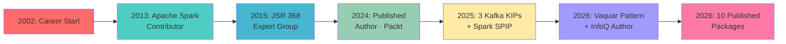
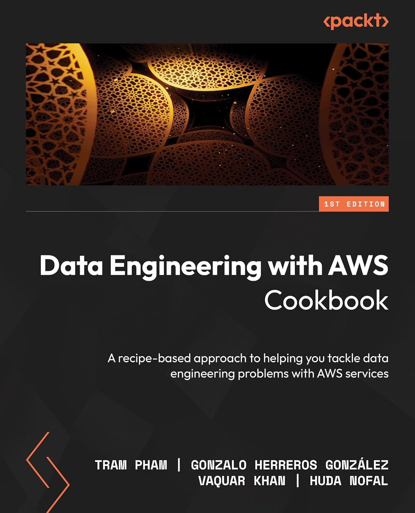

<div align="center">


## **Senior Data Architect @ AWS Professional Services**

<sub>*Also known as: Vaquar Khan | Viquar Khan*</sub>

### AWS | GCP | AZURE | PCF | Microservices | Big Data | Apache Spark | GenAI & Agentic AI | ML/AI SME | Polyglot Developer | Architect | Technology Evangelist

<p align="center">
  
</p>

[](https://www.linkedin.com/in/vaquar-khan-b695577/)
[](https://stackoverflow.com/users/4812170/vaquar-khan)
[](https://github.com/vaquarkhan)
[](https://www.infoq.com/articles/architecting-cloud-native-kafka/)
[](https://adplist.org/mentors/vaquar-khan)


</div>

---

## 🚀 About Me

**Va<sub><sup>i</sup></sub>quar Khan** - Senior Data Architect at **AWS Professional Services** with **22+ years of expertise** in finance and data analytics. I empower global financial institutions to harness the full potential of AWS technologies by designing cutting-edge, customized data solutions tailored to complex industry needs.

As a **polyglot developer** skilled in Java, Scala, Python, and other languages, I specialize in large-scale distributed systems, cloud architecture, big data development, **Generative AI & Agentic AI solutions** using Amazon Bedrock, and **AWS AI/ML solutions** for highly competitive enterprise clients. Ranked in the **top 2% on both GitHub and Stack Overflow** worldwide.

<div align="center">

### ⚡ At a Glance

| | |
|---|---|
| 📦 **[10 Published Packages](#-published-packages)** | [PyPI](https://pypi.org/project/sparkrules/) · [Maven Central](https://central.sonatype.com/artifact/io.github.vaquarkhan/aiv-gate) · [npm](https://www.npmjs.com/package/@mcp-bastion/core) · [Docker GHCR](https://ghcr.io/vaquarkhan/iceguard) |
| 📝 **[3 Apache Kafka KIPs + 1 Spark SPIP](#authored-proposals)** | [KIP-1267](https://cwiki.apache.org/confluence/display/KAFKA/KIP-1267%3A+Tiered+Storage+Cost+Attribution+Metrics) · [KIP-1316](https://cwiki.apache.org/confluence/x/I5E8G) · [KIP-1317](https://cwiki.apache.org/confluence/x/JZE8G) · [SPIP](https://docs.google.com/document/d/1xTvL5YWnHu1jfXvjlKk2KeSv8JJC08dsD7mdbjjo9YE/edit) |
| 🏗️ **[The Vaquar Pattern (PVDM)](https://github.com/vaquarkhan/CogniMesh/blob/main/docs/vaquar-pattern.md)** | Original data integrity architecture for serverless data mesh |
| 🧩 **[The Khan Microservices Pattern](https://github.com/vaquarkhan/microservices-recipes-a-free-gitbook)** | Adaptive Granularity for distributed systems — 600+ ⭐ GitBook |
| 🤖 **[Spring AI AgentCore Observability](https://github.com/vaquarkhan/spring-ai-agentcore-observability)** | 80-feature OpenTelemetry module for Spring AI + Bedrock AgentCore |
| 🐍 **[Apache Burr — S3 Tracking](https://burr.apache.org/docs/concepts/s3-tracking-aws/)** | Contributed AWS-native S3 persistence & tracking for Burr 0.42+ |
| 📊 **[Apache Kafka Community](https://lists.apache.org/list?dev@kafka.apache.org)** | KIP author, dev@ mailing list contributor, Share Groups DLQ architect |
| 🧰 **[73 Agent Skills](https://github.com/vaquarkhan/data-engineering-agent-skills)** | Production-grade AI data engineering workflows · [VS Code](https://marketplace.visualstudio.com/) · [JetBrains](https://plugins.jetbrains.com/) |
| 📰 **[InfoQ](https://www.infoq.com/articles/architecting-cloud-native-kafka/) · [HackerNoon](https://hackernoon.com/u/vaquarkhan) · [DZone](https://dzone.com/users/1436543/vaquarkhan.html) · [AWS Blog](https://aws.amazon.com/blogs/big-data/author/vaquar/)** | Published author across top engineering platforms |
| 🎓 **[Cited by 5+ institutions](#-academic-citations--impact)** | [Q1 Journal](https://www.sciencedirect.com/science/article/abs/pii/S0167739X21002971) · [IEEE](https://ieeexplore.ieee.org/abstract/document/11030417) · [Princeton](https://catalog.princeton.edu/) · [U of Toronto](https://utoronto.scholaris.ca/bitstreams/75d5cf83-8153-43d5-bf88-858bb297dafd/download) · [NTUA](https://dspace.lib.ntua.gr/xmlui/bitstream/handle/123456789/55903/thesis.pdf?sequence=1) |
| 🔥 **[Apache Spark contributor since 2013](https://lists.apache.org/list?dev@spark.apache.org:2014-11:vaquar%20khan)** | 12+ year commitment — voted on Spark 1.1.1 & 1.2.0 release candidates |
| 🏆 **[JSR-368 Expert Group](https://jcp.org/en/jsr/nominations?id=370)** | Shaped Java Messaging standards ([JMS 2.1](https://jcp.org/ja/jsr/nominations?id=369)) |

</div>

<div align="center">

### 🎨 What I Do

   

   

</div>

### 🧠 Skills & Expertise

<div align="center">

| Domain | Skills |
|--------|--------|
| **Cloud & Infrastructure** | AWS (Bedrock, Glue, EMR, Lambda, S3, Athena, SageMaker, Lake Formation) · GCP (BigQuery, Dataflow, Dataproc, Pub/Sub) · Azure (Synapse, ADLS, Event Hubs) · Terraform · CloudFormation · CDK |
| **GenAI & Agentic AI** | Amazon Bedrock Agents · AgentCore · Spring AI · LangChain · RAG Architecture · MCP (Model Context Protocol) · Process Reward Models (GenPRM) · MCTS Inference · RLHF |
| **Big Data & Streaming** | Apache Spark · Apache Kafka · Apache Flink · Apache Iceberg · Delta Lake · Hudi · Structured Streaming · Kafka Streams · Spark Connect |
| **Programming** | Java · Python · Scala · Go · Rust · SQL · PySpark |
| **Data Engineering** | ETL/ELT Pipelines · Data Lakehouse · Medallion Architecture · CDC · Schema Evolution · Data Quality (DQ) · Data Governance · Data Mesh |
| **AI/ML** | TensorFlow · PyTorch · scikit-learn · SageMaker · Feature Engineering · ML Pipelines · Reinforcement Learning |
| **Microservices & APIs** | Spring Boot · Spring Cloud · Domain-Driven Design · CQRS · Event Sourcing · gRPC · GraphQL · API Gateway |
| **DevOps & Orchestration** | Kubernetes · Docker · Istio · Airflow · Step Functions · CI/CD · GitOps · Helm |
| **Databases** | PostgreSQL · DynamoDB · MongoDB · Redis · Cassandra · Redshift · Snowflake · ElasticSearch |
| **Messaging & Integration** | Apache Kafka · RabbitMQ · JMS 2.1 (JSR-368 Expert) · SQS/SNS · EventBridge · Kinesis |
| **Security & Compliance** | IAM · KMS · Lake Formation · RBAC · PII/PCI/HIPAA · GDPR · SOX · Data Lineage |
| **Tools & Methodologies** | Agile · System Design · Distributed Systems · CAP Theorem · FinOps · Cost Attribution · Observability (OpenTelemetry, X-Ray) |

</div>

### 🎖️ Industry Contributions & Recognition

- **JSR 368 Expert Group Member**: Shaped industry standards for Java™ Message Service 2.1 — [JCP Nomination](https://jcp.org/en/jsr/nominations?id=370) · [JSR-369](https://jcp.org/ja/jsr/nominations?id=369)
- **Apache Spark Committer (since 2013)**: 12+ year commitment — voted on release candidates since Spark 1.1.1 (2014) and Spark 1.2.0 ([dev@ mailing list archive](https://lists.apache.org/list?dev@spark.apache.org:2014-11:vaquar%20khan))
- **AWS AI/ML Expert**: Designing intelligent data solutions with AWS AI services
- **GenAI & Agentic AI SME**: Architecting solutions with Amazon Bedrock, Bedrock Agents, and AgentCore
- **Open Source Contributor**: Active contributions to Apache Spark, Apache Kafka, Apache Burr, and Terraform ecosystems
- **Stack Overflow Impact**: Technical insights reaching **7.5+ million users**
- **GitHub Recognition**: 1400+ stars across repositories and wikis
- **AWS Professional Services**: Architecting enterprise-grade solutions for global financial institutions
- **Community Leader**: 243 stars on Apache Kafka POC, 70 stars on DDD resources, 1.3k+ forks across projects

### 🔬 Open Source Proposals (KIP / SPIP)

#### Authored Proposals

| Project | Proposal | Description |
|---------|----------|-------------|
| **Apache Kafka** | [KIP-1267: Tiered Storage Cost Attribution Metrics](https://cwiki.apache.org/confluence/display/KAFKA/KIP-1267%3A+Tiered+Storage+Cost+Attribution+Metrics) | Client-level cost attribution for Kafka Tiered Storage — enables FinOps, chargeback, and rogue consumer detection in multi-tenant clusters |
| **Apache Kafka** | [KIP-1316: Circuit Breaker for Share Group DLQ Overflow](https://cwiki.apache.org/confluence/x/I5E8G) | Prevents cascading failures when Share Group DLQ fills up — introduces circuit breaker pattern to protect cluster stability at scale |
| **Apache Kafka** | [KIP-1317: Mandatory DLQ Disposition Header for Share Groups](https://cwiki.apache.org/confluence/x/JZE8G) | Ensures every DLQ-routed record carries authoritative disposition metadata — enables observability, audit, and automated remediation |
| **Apache Spark** | [SPIP: Asynchronous Metadata Resolution & Lazy Prefetching for Spark Connect](https://docs.google.com/document/d/1xTvL5YWnHu1jfXvjlKk2KeSv8JJC08dsD7mdbjjo9YE/edit) | Performance optimization for Spark Connect metadata resolution and prefetching |
| **Apache Iceberg** | [Real-Time Agentic RAG Architecture with Iceberg v3](https://hackernoon.com/real-time-agentic-rag-eradicating-context-rot-with-spark-and-iceberg) | Published architecture leveraging Iceberg v3 deletion vectors + Spark 4.1 Intent-Driven Design for low-latency CDC in agentic AI systems |

#### Spring AI & Apache Burr Contributions

| Project | What I Built / Proposed | Description |
|---------|------------------------|-------------|
| **Spring AI AgentCore** | [spring-ai-agentcore-observability](https://github.com/vaquarkhan/spring-ai-agentcore-observability) | **Designed & implemented** full OpenTelemetry observability module — 80 features across 12 categories: GenAI semantic spans, token histograms, AgentCore session correlation, reactive Mono/Flux instrumentation, PII-safe export with Luhn-validated masking, 96.5% coverage gate |
| **Apache Burr** | [S3 Tracking on AWS](https://burr.apache.org/docs/concepts/s3-tracking-aws/) | **Contributed** AWS-native S3 tracking & persistence for Burr 0.42+ — enables production deployment with S3-backed state storage, hybrid local/cloud modes, and cost-efficient agent observability on AWS |
| **Spring AI Community** | [spring-ai-agentcore](https://github.com/vaquarkhan/spring-ai-agentcore) | **Contributing** Spring Boot integrations for Amazon Bedrock AgentCore Runtime |

### 🐛 Terraform AWS Glue Data Quality (Issues & Contributions)

| Project | Issue | Description |
|---------|-------|-------------|
| **Terraform AWS Provider** | [#38744: glue_data_quality_ruleset rules not supporting multi line string](https://github.com/hashicorp/terraform-provider-aws/issues/38744) | Bug report & resolution — AWS Glue Data Quality ruleset failed with heredoc multiline strings; documented workaround using `join()` for readable DQDL rules |
| **Terraform AWS Provider** | [#39821: aws_glue_security_configuration should support encrypting Glue Data Quality](https://github.com/hashicorp/terraform-provider-aws/issues/39821) | Enhancement request — Add `data_quality_encryption` block to fix security findings when S3/KMS/CloudWatch are encrypted but Glue Data Quality remains unencrypted |

### 🏆 Proprietary Methodologies & Patterns

Creator of original frameworks for distributed systems and data engineering:

| Pattern | Domain | What It Solves |
|---------|--------|----------------|
| **[The Vaquar Pattern (PVDM)](https://github.com/vaquarkhan/CogniMesh/blob/main/docs/vaquar-pattern.md)** | Data Mesh / Serverless | Proof-gated serverless data mesh writes — Physical → Verify → Durable → Metadata. No catalog commit without multiset VRP proof. Prevents silent row loss, partial writes, and catalog drift. Implemented in CogniMesh + veridata. |
| **The Khan Pattern** | Microservices | Adaptive Granularity — stop splitting, start governing microservice boundary decisions |
| **The Khan Granularity Protocol** | Distributed Systems | Scoring methodology for distributed systems granularity decisions |
| **The Khan Microservices Maturity Model (KM3)** | Architecture | Operationalized distributed systems theory — maturity scoring for organizations |

**The Vaquar Pattern** core invariant:
```
commit_metadata ⟹ VRP = PASS
```
> No Iceberg snapshot, Glue catalog update, or marketplace listing may proceed unless multiset verification passes for every committed chunk.

<details>
<summary><b>PVDM Phases (click to expand)</b></summary>

| Phase | Name | Responsibility | Implementation |
|-------|------|---------------|----------------|
| 0 | **Rules** | Schema, security, compliance checks at design time | Integrity Gate + SparkRules DRL |
| 1 | **Physical** | Chunked Parquet writes with checkpoint & rollback | IceGuard |
| 2 | **Verify** | Multiset + transform VRP proof (SHA-256, Merkle, KMS-signed) | veridata VRP engine |
| 3 | **Durable** | 15-min Lambda segments, Step Functions resume loop | SFN durable execution |
| 4 | **Metadata** | Proof-gated Glue/Iceberg catalog commit | GlueCatalogConnector |

**PVDM-A (Decision Attestation):** Extends proof chain into agentic systems — signed attestations binding agent decisions to verified VRP inputs via gateway tokens. Proves decision provenance without proving semantic correctness.

</details>

### 🔧 Featured Projects

> See the full **[Open Source Projects & Packages](#-open-source-projects--packages)** section below for detailed descriptions, install commands, and download stats.

[](https://pypi.org/project/sparkrules/)
[](https://central.sonatype.com/artifact/io.github.vaquarkhan/aiv-gate)
[](https://github.com/vaquarkhan/MCP-Bastion)

---

## 🚀 Open Source Projects & Packages

<div align="center">

### 📦 Published Packages

[](https://pepy.tech/project/sparkrules)
[](https://pepy.tech/project/iceguard)
[](https://pepy.tech/project/genprm)
[](https://pepy.tech/project/mcp-bastion-python)
[](https://pepy.tech/project/mcp-test-harness)
[](https://pepy.tech/project/veridata-vrp)

| Registry | Package | Description | Install |
|----------|---------|-------------|---------|
| [](https://pypi.org/project/sparkrules/) | **sparkrules** `v1.2.0` | Drools-equivalent business rule engine for Python — DRL syntax, decision tables, adverse-action notices, Spark integration | `pip install sparkrules` |
| [](https://pypi.org/project/genprm/) | **genprm** | Autonomous data engineering agent — generative process supervision, MCTS inference, RL fine-tuning for SQL/ETL self-correction | `pip install genprm` |
| [](https://pypi.org/project/iceguard/) | **iceguard** `v1.0.0` | Reliability library for Spark-on-AWS-Lambda — timeout rollback, checkpoints, orphan cleanup. Also on [Docker (GHCR)](https://ghcr.io/vaquarkhan/iceguard) | `pip install iceguard` |
| [](https://pypi.org/project/veridata-vrp/) | **veridata-vrp** | Offline VRP verifier — tamper-evident reconciliation proofs for data pipelines | `pip install veridata-vrp` |
| [](https://pypi.org/project/mcp-bastion-python/) | **mcp-bastion-python** | Enterprise MCP security middleware + 16 framework integrations (LangChain, OpenAI, Anthropic, Bedrock…) | `pip install mcp-bastion-python` |
| [](https://pypi.org/project/mcp-test-harness/) | **mcp-test-harness** `v1.1.0` | Testing framework for MCP servers — functional, regression, performance. Also on [Docker (GHCR)](https://ghcr.io/vaquarkhan/mcp-test-harness) | `pip install mcp-test-harness` |
| [](https://www.npmjs.com/package/@mcp-bastion/core) | **@mcp-bastion/core** | TypeScript/Node.js MCP security middleware | `npm install @mcp-bastion/core` |
| [](https://central.sonatype.com/artifact/io.github.vaquarkhan/ai-agent-java-sdk-core) | **ai-agent-java-sdk** `v0.1.0` | Model-driven autonomous AI agent SDK for Java — zero-trust MCP security, Spring AI AgentCore integration | `io.github.vaquarkhan:ai-agent-java-sdk-core` |
| [](https://central.sonatype.com/artifact/io.github.vaquarkhan/aiv-gate) | **aiv-gate** | AI-powered PR integrity gate — density, design, dependency & invariant checks | `io.github.vaquarkhan:aiv-gate` |
| [](https://central.sonatype.com/artifact/io.github.vaquarkhan/aiv-cli) | **aiv-cli** | CLI companion for aiv-integrity-gate | `io.github.vaquarkhan:aiv-cli` |

</div>

### 🔥 SparkRules — Business Rule Engine for Python & Spark

<div align="center">

[](https://github.com/vaquarkhan/sparkrules)
[](https://pypi.org/project/sparkrules/)
[](https://pepy.tech/project/sparkrules)
[](https://github.com/vaquarkhan/sparkrules/blob/main/LICENSE)

</div>

> **The business rule engine that Python was missing.** Drools-style DRL syntax, explainable decisions, regulatory-grade audit trails — from laptop to lakehouse, no JVM required.

**Key Features:**
- 🎯 **Drools-style DRL** — same syntax, no JVM, Python-native
- 📊 **Decision Tables** — XLSX-style with hit policies (UNIQUE, FIRST, PRIORITY, COLLECT)
- ⚖️ **Regulatory Compliance** — ECOA/FCRA/GDPR Art 22 adverse-action notices
- 🔍 **Data Quality + Profiling** — built-in DQ checks + statistical profiling
- 🌐 **FastAPI + Rules Workbench** — browser-based Monaco DRL editor with LSP
- 🧪 **Simulation Modes** — shadow, counterfactual, coverage, chain
- ⚡ **Performance** — ~199K evals/sec, 840+ tests, 100% line coverage
- 🚀 **Multi-Platform** — AWS Glue, Databricks, GCP Dataproc, Azure Synapse, Kubernetes

<details>
<summary>📋 Use Cases</summary>

| Domain | Scenario |
|--------|----------|
| 💳 Lending | Loan underwriting + adverse-action notices for declines |
| 💰 Payments | POS end-of-day batch rule evaluation |
| 🏥 Healthcare | Clinical trial eligibility screening |
| 🛡️ Fraud | Real-time transaction authorization with explainable declines |
| 📜 Compliance | Deterministic settlement replay for audit |
| 🏦 Insurance | Claims adjudication via decision tables |

</details>

### 🛡️ MCP-Bastion — Security Gateway for AI Agents

<div align="center">

[](https://github.com/vaquarkhan/MCP-Bastion)
[](https://pypi.org/project/mcp-bastion-python/)
[](https://www.npmjs.com/package/@mcp-bastion/core)
[](https://ghcr.io/vaquarkhan/mcp-bastion-proxy)

</div>

> Enterprise-grade security middleware for the Model Context Protocol — 100% local, <5ms overhead, **16 framework integrations**.

**Problems Solved:** Prompt injection & jailbreaks · PII leakage to LLMs · Runaway agents burning API budget · Unpredictable agentic behavior

**Features:** Meta PromptGuard · Microsoft Presidio PII redaction · Token budget & rate limiting · Infinite loop protection · RBAC · Schema validation · Replay guard · Cost tracker · Semantic cache · Audit logging

**Framework Integrations:** LangChain · OpenAI · Anthropic · Amazon Bedrock · Google Vertex AI · Cohere · Mistral · Hugging Face · LlamaIndex · CrewAI · AutoGen · Semantic Kernel · Spring AI · FastMCP · and more

### 🔒 aiv-integrity-gate — AI-Powered PR Quality Gate

<div align="center">

[](https://github.com/vaquarkhan/aiv-integrity-gate)
[](https://central.sonatype.com/artifact/io.github.vaquarkhan/aiv-gate)

</div>

> Eliminates reviewer overload and low-quality PRs with automated density, design, dependency, and invariant gates.

**Gates:** Logic Density & Entropy · YAML Design Rules (forbidden/required patterns) · Import Validation vs pom.xml/requirements.txt · Property-based Invariant Tests · `/aiv skip` for urgent merges · Refactor exception · Trusted authors bypass

### 🧰 Data Engineering Agent Skills — AI Agent Skill Registry

<div align="center">

[](https://github.com/vaquarkhan/data-engineering-agent-skills)
[](https://marketplace.visualstudio.com/items?itemName=vaquarkhan.data-engineering-agent-skills)
[](https://plugins.jetbrains.com/plugin/data-engineering-agent-skills)

</div>

> Production-grade skill registry for AI data engineering agents — **73 workflows, 14 platform presets**, multi-agent packaging.

**Lifecycle:** `/spec` → `/plan` → `/build` → `/validate` → `/review` → `/backfill` → `/ship`

**Platform Presets:** AWS · Azure · GCP · Databricks · Snowflake · Alibaba Cloud · Informatica · Talend · Apache Spark · Flink · Airflow · Kafka · Iceberg

**Agent Integrations:** Cursor · Claude · Copilot · Kiro · Codex · OpenCode · Windsurf · AGENTS.md

**Skill Coverage:** Ingestion · Transformation · Orchestration · Streaming · Lakehouse · Warehousing · Governance · Quality · Modernization · Release · Incident Recovery · Platform Operations

---

## 🧠 Data Engineering Agent Skills — Full Impact

<div align="center">

> *"The goal is not to give agents generic prompts. The goal is to give them operating procedures for defining, planning, implementing, validating, replaying, and shipping reliable data products."*

</div>

### Why This Exists

AI agents often default to the shortest path — which is dangerous in data systems:
- ❌ Skipping specification and contract definition
- ❌ Treating a successful run as proof of correctness
- ❌ Ignoring replay, backfill, and consumer impact
- ❌ Leaving lineage, access, retention, and ownership implicit

This project enforces **engineering discipline** on AI agents — the same standards used by strong data engineering teams.

### 📊 By the Numbers

| Metric | Count |
|--------|-------|
| Workflow Skills | **73** |
| Platform Presets | **14** (AWS, Azure, GCP, Databricks, Snowflake, Alibaba, Informatica, Talend, Spark, Flink, Airflow, Kafka, Iceberg, Multi-cloud) |
| Runnable Example Scaffolds | **5** (with Makefile, contract validation, smoke tests) |
| Architecture Blueprints | **9** (spec/plan/tasks — delivery shape without executable code) |
| Starter Packs | **13** (opinionated bundles by use case) |
| Tutorials | **14** (streaming, orchestration, resiliency, governance, modernization) |
| Case Studies | **3** (incident recovery, replay safety, regulated release) |
| Agent Personas | **5** (architect, analytics, reliability, infrastructure, compliance) |
| Reference Guides | **20+** (architecture, testing, compliance, anti-patterns, DR/BCP) |
| Hooks | **8** (session-start, contract-check, schema-guard, cost-check, release-guard) |
| Machine-readable Templates | **8** (dataset contracts, compliance controls, backfill plans, release gates) |

### 🎯 Agent Benchmark Results

The included agent benchmark pack measures skill impact quantitatively:

| Metric | Without Skills | With Skills |
|--------|---------------|-------------|
| Task Coverage Score | 23 | **67** |
| Improvement | — | **+191%** |

### 🛠️ Skill Categories

<details>
<summary><b>Click to expand full skill list (73 workflows)</b></summary>

| Category | Skills |
|----------|--------|
| **Core Delivery** | data-specification · pipeline-planning · data-quality-and-contract-testing · orchestration-and-backfills · lineage-pii-and-governance |
| **Cloud Platforms** | spark-and-distributed-processing · airflow-and-workflow-orchestration · streaming-and-messaging-systems · lakehouse-table-format-engineering |
| **Data Architecture** | data-lake-and-zone-architecture · warehouse-and-schema-design · delta-lake-and-medallion-architecture · data-mesh-and-domain-oriented-design |
| **Languages** | python-data-engineering · scala-data-engineering-on-jvm · java-data-engineering-and-integration-services |
| **Governance** | data-security-compliance-and-regulated-data · regional-data-compliance-and-sovereignty · esg-and-sustainability-regulatory-reporting · privacy-retention-and-right-to-delete |
| **Platform Governance** | glue-data-catalog-and-lake-formation · unity-catalog-and-lakehouse · microsoft-purview-and-azure-data-governance · dataplex-and-bigquery-governance |
| **Modernization** | etl-elt-and-modernization-strategy · mainframe-modernization-and-data-offload · enterprise-etl-and-data-integration-modernization |
| **Operations** | incident-triage-and-pipeline-recovery · data-platform-disaster-recovery · data-platform-operating-model-and-service-ownership · data-observability-and-sla-management |
| **Testing & Quality** | data-resiliency-testing-and-failure-injection · test-data-preparation-and-synthetic-data · lower-environment-data-masking · data-reconciliation-and-financial-controls |
| **Integrations** | cdc-and-incremental-loading · schema-evolution-and-contract-migrations · api-and-saas-ingestion-patterns · reverse-etl-and-operational-data-serving |
| **Reliability** | safe-backfill-and-replay-orchestration · spark-serverless-reliability · kafka-resilience-and-schema-evolution · mcp-data-observability-integration |

</details>

### 🌐 Install Surfaces

| Surface | Method |
|---------|--------|
| **VS Code / Cursor / Windsurf / VSCodium** | [Marketplace](https://marketplace.visualstudio.com/) or `.vsix` download |
| **JetBrains (IntelliJ, PyCharm, DataGrip)** | [Marketplace](https://plugins.jetbrains.com/) or `.zip` download |
| **Claude** | `.claude/commands/` + `.claude-plugin/` + `CLAUDE.md` |
| **Copilot** | `.github/copilot-instructions.md` |
| **Kiro** | `.kiro/steering/` |
| **Codex / OpenCode** | `AGENTS.md` + `docs/codex-setup.md` |
| **CLI** | `scripts/install.sh --tool all --target /path` |

### 📚 Other Notable Repositories

<div align="center">

| Repository | Lang | ⭐ | Description |
|-----------|------|---|-------------|
| [vaquarkhan/vaquarkhan](https://github.com/vaquarkhan/vaquarkhan) | Wiki | 1.5K+ | Technical wiki — Spark, Kafka, Microservices, DDD, Cloud Architecture |
| [autonomous-data-engineering-agent](https://github.com/vaquarkhan/autonomous-data-engineering-agent) | Python | — | Autonomous agent that generates, verifies & self-corrects SQL/ETL using GenPRM, MCTS inference, sandbox execution, and RL fine-tuning with reward-hacking safeguards. Published as `pip install genprm` |
| [veridata](https://github.com/vaquarkhan/veridata) | Rust/Python | — | Verifiable Reconciliation Proofs (VRPs) — signed, tamper-evident receipts proving data sink faithfully reflects source. Detects drops, duplicates, mutations. Multi-cloud (AWS/GCP/Azure/Databricks) |
| [data-engineering-agent-skills](https://github.com/vaquarkhan/data-engineering-agent-skills) | Multi | — | Production-grade AI agent skill registry — 73 workflows, 14 platform presets, VS Code & JetBrains plugins, multi-agent packaging (Cursor, Claude, Copilot, Kiro, Codex) |
| [IceGuard](https://github.com/vaquarkhan/IceGuard) | Python | 1 | Reliability library for Spark-on-AWS-Lambda writes — timeout-aware rollback, resumable checkpointing, orphan cleanup, multi-Lambda coordination, CloudWatch observability |
| [ai-agent-java-sdk](https://github.com/vaquarkhan/ai-agent-java-sdk) | Java | 2 | Model-driven autonomous AI agent SDK — zero-trust MCP security (PromptGuard, Presidio PII, token budgets), Spring AI AgentCore native, infinite-loop protection. Inspired by AWS Strands Agents. Maven Central: `io.github.vaquarkhan` |
| [mcp-test-harness](https://github.com/vaquarkhan/mcp-test-harness) | Python | 2 | Testing framework for MCP servers — validate tool schemas, test prompts, assert responses |
| [spring-ai-agentcore](https://github.com/vaquarkhan/spring-ai-agentcore) | Java | 1 | Fork of spring-ai-community/spring-ai-agentcore — Spring Boot integrations for Amazon Bedrock AgentCore |
| [spring-ai-agentcore-observability](https://github.com/vaquarkhan/spring-ai-agentcore-observability) | Java | — | OpenTelemetry observability for Spring AI AgentCore — 80 features across 12 categories (tracing, metrics, health, cost tracking) |
| [burr](https://github.com/vaquarkhan/burr) | Python | 1 | Fork of apache/burr — Build applications that make decisions (chatbots, agents, simulations). Monitor, trace, persist, and execute on your own infrastructure |
| [microservices-recipes-a-free-gitbook](https://github.com/vaquarkhan/microservices-recipes-a-free-gitbook) | GitBook | 600+ | Free GitBook on microservices patterns (280+ forks) |
| [Apache-Kafka-poc-and-notes](https://github.com/vaquarkhan/Apache-Kafka-poc-and-notes) | Java | 243+ | Apache Kafka POC with comprehensive notes & patterns |
| [apache-kafka-spark-streaming-poc](https://github.com/vaquarkhan/apache-kafka-spark-streaming-poc) | Java | 11 | Kafka + Spark Streaming integration POC (15 forks) |
| [awesome-spring-reactive-webflux](https://github.com/vaquarkhan/awesome-spring-reactive-webflux) | Java | 4 | Spring Reactive WebFlux — Mono/Flux diagrams (13 forks) |
| [Real-time-Fraud-Analysis-Spark](https://github.com/vaquarkhan/Real-time-Fraud-Analysis-Spark) | Scala | — | Real-time fraud detection with Kafka, Spark & Cassandra |

</div>

---

---


## 🎯 Career Highlights & Milestones

<div align="center">


```mermaid
graph LR
    A[2002: Career Start] --> B[2013: Apache Spark<br/>Contributor]
    B --> C[2015: JSR 368<br/>Expert Group]
    C --> D[2024: Published<br/>Author · Packt]
    D --> E[2025: 3 Kafka KIPs<br/>+ Spark SPIP]
    E --> F[2026: Vaquar Pattern<br/>+ InfoQ Author]
    F --> G[2026: 10 Published<br/>Packages]
    
    style A fill:#ff6b6b
    style B fill:#4ecdc4
    style C fill:#45b7d1
    style D fill:#96ceb4
    style E fill:#ffeaa7
    style F fill:#a29bfe
    style G fill:#fd79a8
```

</div>

## 🏆 International Academic Recognition

My open-source repositories and technical wikis have been cited as **foundational references** in advanced postgraduate research across multiple continents and critical domains:

### 📊 Academic Citations & Impact

<div align="center">

| Institution | Country | Research Domain | Citation Impact | PDF · Research |
|-------------|---------|-----------------|-----------------|----------------|
| **IEEE ICCCBDA 2025** | 🌍 International | Supply Chain Data Management | *Data Engineering with AWS Cookbook* cited as reference for AWS-based ETL architecture | [IEEE Xplore](https://ieeexplore.ieee.org/abstract/document/11030417) |
| **University of Southern Denmark** | 🇩🇰 Denmark | Intelligent Transportation Systems (V2X) | Smart City traffic management & GLOSA systems | [📄 Thesis PDF](https://simonhl.dk/wp-content/uploads/2019/08/Simon-Hjortsh%C3%B8j-Larsen-Thomas-August-Lemqvist-Master-Thesis.pdf) |
| **University of Toronto** | 🇨🇦 Canada | Healthcare Big Data Analytics | MRI wait-time optimization (600GB dataset) | [📄 Thesis PDF](https://utoronto.scholaris.ca/bitstreams/75d5cf83-8153-43d5-bf88-858bb297dafd/download) |
| **National Technical University of Athens** | 🇬🇷 Greece | Cloud Computing & Kubernetes | Novel autoscaling algorithms for local storage | [📄 Thesis PDF](https://dspace.lib.ntua.gr/xmlui/bitstream/handle/123456789/55903/thesis.pdf?sequence=1) |
| **Multi-National Collaboration** | 🌍 Global | Blockchain Scalability | Published in *Future Generation Computer Systems* (Q1 Journal) | [📄 Survey PDF](https://www.open-access.bcu.ac.uk/12221/1/Scalable_Blockchains_Survey_R1_CLEAN.pdf) · [ScienceDirect](https://www.sciencedirect.com/science/article/abs/pii/S0167739X21002971) · [ACM](https://dl.acm.org/doi/abs/10.1016/j.future.2021.07.035) |

</div>


### 📚 University Library Cataloging

*Data Engineering with AWS Cookbook* (Packt, 2024) is cataloged in the library systems of the following universities, available as a resource for students and faculty in data engineering and cloud computing programs:

<div align="center">

| University | Country | Library System |
|------------|---------|----------------|
| **Brandeis University** | 🇺🇸 USA | Brandeis OneSearch — available for M.S. Strategic Analytics & Computer Science programs |
| **Princeton University** | 🇺🇸 USA | Princeton University Library — science & engineering collections |
| **Northumbria University** | 🇬🇧 UK | Northumbria University Library Search |

</div>

### 📰 Citations & References (Blogs, Newsletters, Community)

My wikis, repos, and contributions are cited across blogs, newsletters, and open-source communities:

#### 🎬 YouTube Videos Citing Stack Overflow Answers

Videos that cite my [Stack Overflow answers](https://stackoverflow.com/users/4812170/vaquar-khan) (7.5M+ reach):

| Video | Channel | Link |
|-------|---------|------|
| Why is my Spark job getting stuck when collect() is called? | vlogize | [Watch](https://www.youtube.com/watch?v=7pF9njRveCw) |
| How to associate an existing RDS instance to an Elastic Beanstalk environment? | Roel Van de Paar | [Watch](https://www.youtube.com/watch?v=onw0HbMFj7c) |

**Find more videos:** Many additional videos cite my answers across these channels. Browse or search for topics I frequently answer:

- **[The Debug Zone](https://www.youtube.com/@TheDebugZone/videos)** — Stack Overflow–based debugging tutorials
- **[Roel Van de Paar](https://www.youtube.com/@RoelVandePaar)** — Technical Q&A from Stack Overflow/ServerFault (2M+ videos)
- **[Search: vaquarkhan stackoverflow](https://www.youtube.com/results?search_query=vaquarkhan+stackoverflow)**

*Topics I often answer: Apache Spark, Kafka, AWS (Elastic Beanstalk, RDS, API Gateway), Spring Boot, Docker, Maven/Jacoco*

| Source | What's Cited | Link |
|--------|--------------|------|
| **Get Kafka-Nated (Substack)** | Kafka mailing list thread on cloud-native KIPs; KIP-1267 (Tiered Storage Cost Attribution) | [Biweekly #276](https://getkafkanated.substack.com/p/get-kafka-nated-espresso-biweekly-276) |
| **Gradle Discuss** | Microservice example from GitHub (troubleshooting run) | [Thread #43549](https://discuss.gradle.org/t/problems-when-trying-to-run-an-old-microservice-example-from-github/43549) |
| **Dev.to** | CQRS & Event Sourcing wiki | [Deep Dive into Microservices](https://dev.to/kgoralski/deep-dive-into-microservices-architecture-h54) |
| **Medium (Jon SY Chan)** | Horizontal vs Vertical scaling wiki | [Scaling up Concepts for Servers](https://medium.com/@jonathansychan/scaling-up-concepts-for-servers-d510d6b3e9ca) |
| **Medium (Shiksha Engineering)** | awesome-spring-reactive-webflux (Reactor Mono/Flux diagrams) | [Reactive Programming](https://shiksha-com.medium.com/reactive-programming-1b2906bf7c5) |
| **Apache Spark User List** | Codegen 64KB limit; Kafka vs Spark Streaming (community help) | [msg69132](https://www.mail-archive.com/user@spark.apache.org/msg69132.html) · [msg62385](https://www.mail-archive.com/user@spark.apache.org/msg62385.html) |
| **Oracle JMS 2.1** | JMS Expert Group participation (meeting minutes) | [Meeting 3](https://download.oracle.com/javaee-archive/jms-spec.java.net/users/2015/11/1108.html) · [Meeting 2](https://download.oracle.com/javaee-archive/jms-spec.java.net/users/2015/10/1080.html) · [Sep](https://download.oracle.com/javaee-archive/jms-spec.java.net/users/2015/09/1035.html) |
| **DZone** | 3 articles, 118K+ pageviews | [Profile](https://dzone.com/users/1436543/vaquarkhan.html) |
| **Eclipse Jersey** | Bug report — HashMap JSON serialization | [#3432](https://github.com/eclipse-ee4j/jersey/issues/3432) |
| **Apache Amoro** | Technical analysis — reachMinorInterval "noisy neighbor" fix | [#4055](https://github.com/apache/amoro/issues/4055) |
| **Jakarta Messaging** | JMS INDIVIDUAL_ACKNOWLEDGE spec discussion | [#95](https://github.com/jakartaee/messaging/issues/95) |
| **data-dot-all** | Bug report — Windows CDK deployment (workaround: WSL) | [#340](https://github.com/data-dot-all/dataall/issues/340) |
| **AWS Athena Query Federation** | Feature request — DynamoDB table filter for Athena (PR #607) | [#606](https://github.com/awslabs/aws-athena-query-federation/issues/606) |


## 💻 Tech Stack

<div align="center">

### ☁️ Cloud & AI/ML Platforms


### 💻 Languages & Frameworks


### 📊 Big Data & Analytics


### 🤖 AI/ML & Data Science


### 🐳 Container Orchestration & Microservices


### 🗄️ Databases & Storage


### 📨 Messaging & Streaming


</div>

## 📚 My Books & Resources

<div align="center">

### 📖 Published Works

<table>
<tr>
<td align="center" width="50%">

<a href="https://www.amazon.com/Data-Engineering-AWS-Cookbook-recipe-based/dp/1805127284">

</a>

**Data Engineering AWS Cookbook**

Recipe-based guide for AWS data engineering


[](https://www.amazon.com/Data-Engineering-AWS-Cookbook-recipe-based/dp/1805127284)

</td>
<td align="center" width="50%">

<a href="https://vaquarkhan.github.io/microservices-recipes-a-free-gitbook/">

</a>

**Microservices Recipes**

A comprehensive free GitBook on microservices patterns

⭐ **Free & Open Source**
⭐ **600+ GitHub Stars · 280+ forks**


[](https://vaquarkhan.github.io/microservices-recipes-a-free-gitbook/)
[](https://github.com/vaquarkhan/microservices-recipes-a-free-gitbook)

</td>
</tr>
</table>

</div>

## 🎯 Real-World Impact

<div align="center">

| Domain | Impact | Scale |
|--------|--------|-------|
| 🚗 **Smart Cities** | Backend architecture for V2X traffic management | Reducing carbon emissions across European cities |
| 🏥 **Healthcare** | Big data pipelines for medical imaging analytics | Processing 600GB+ datasets for cancer diagnosis optimization |
| ☁️ **Cloud Infrastructure** | Kubernetes autoscaling innovations | Enabling cost-efficient resource utilization at scale |
| ⛓️ **Blockchain** | Knowledge curation & scalability research | Supporting systematic reviews in Q1 journals |
| 💰 **Financial Services** | AWS data solutions for global institutions | Empowering fintech transformation at enterprise scale |
| 📚 **Education** | Open-source technical resources | Cited by researchers at top universities worldwide |

</div>

### 🔗 Additional Links

- 🔥 [Apache Spark Community Contributions](http://apache-spark-developers-list.1001551.n3.nabble.com/template/NamlServlet.jtp?macro=user_nodes&user=619)
- 📋 [JCP Member - JSR-368](https://www.jcp.org/en/jsr/detail?id=368)

---


## ✍️ Writing & Community

<div align="center">

### 🎯 Writing & Community

[](https://hackernoon.com/u/vaquarkhan)
[](https://medium.com/@vaquarkhan)
[](https://dzone.com/users/1436543/vaquarkhan.html)
[](https://www.infoq.com/profile/Vaquar-Khan.2)
[](https://aws.amazon.com/blogs/big-data/author/vaquar/)

</div>

### ☁️ AWS Official Blog

| Article | Platform | Topic |
|---------|----------|-------|
| [Deploying AWS Glue Data Quality Pipelines Using Terraform](https://aws.amazon.com/blogs/big-data/author/vaquar/) | AWS Big Data Blog | IaC best practices for Glue Data Quality — consistent, version-controlled deployments across environments |

### 🟢 HackerNoon Articles

| Article | Published | Topic |
|---------|-----------|-------|
| [Production Observability for Spring AI Agents on Amazon Bedrock Without Writing Tracing Code](https://hackernoon.com/production-observability-for-spring-ai-agents-on-amazon-bedrock-without-writing-tracing-code) | May 2026 | Zero-code observability for Spring AI agents on Bedrock — OpenTelemetry, X-Ray, and CloudWatch integration |
| [Real-Time Agentic RAG: Eradicating Context Rot With Spark & Iceberg](https://hackernoon.com/real-time-agentic-rag-eradicating-context-rot-with-spark-and-iceberg) | Mar 2026 | Architecture using Spark 4.1 & Apache Iceberg v3 deletion vectors for low-latency CDC to keep embedding stores fresh |

### 📰 DZone Articles (118K+ pageviews)

| Article | Views | Topic |
|---------|-------|-------|
| [AWS Lambda With MySQL (RDS) and API Gateway](https://dzone.com/articles/aws-lambda-with-mysql-rds-and-api-gateway) | 47K+ | Microservices with AWS API Gateway & RDS |
| [Run AWS Lambda Functions Locally on Windows](https://dzone.com/articles/run-aws-lambda-functions-locally-on-windows-machin) | 60K+ | SAM Local for Lambda development |
| [Fast Data Access: GemFire + Apache Spark](https://dzone.com/articles/fast-data-access-using-gemfire-and-apache-spark-pa) | 12K+ | In-memory data grid with Spark |

### ✏️ Medium Articles

| Article | Topic |
|---------|-------|
| [Amazon API Gateway with Spring Boot — Tricks and Hacks](https://medium.com/@vaquarkhan/amazon-api-gateway-with-spring-boot-tricks-and-hacks-8315d49827d) | REST, WebSocket, HTTP API patterns with Spring Boot on AWS |

### 🎤 InfoQ

| Article | Published | Topic |
|---------|-----------|-------|
| [Architecting Cloud-Native Kafka: From Tiered Storage Towards a Diskless Future](https://www.infoq.com/articles/architecting-cloud-native-kafka/) | 2026 | Deep-dive into Kafka's cloud-native evolution — Tiered Storage economics, KIP-1267 cost attribution, KIP-848 consumer rebalancing, KIP-932 Share Groups, KIP-1134 Virtual Clusters, and the diskless future (KIP-1150/1163). References KIP-1316 & KIP-1317. |

[](https://www.infoq.com/profile/Vaquar-Khan.2)

### 📣 Featured In & Press Coverage

| Source | Coverage | Link |
|--------|----------|------|
| **InfoQ (Article)** | "Architecting Cloud-Native Kafka" — flagship article covering Tiered Storage, FinOps, Share Groups, Virtual Clusters, and the Diskless future. Directly references KIP-1267, KIP-1316, KIP-1317 | [Read](https://www.infoq.com/articles/architecting-cloud-native-kafka/) |
| **LetsDataScience** | "Viquar Khan Proposes Real-Time RAG Architecture" — featured news coverage of the Spark + Iceberg agentic RAG approach | [Read](https://letsdatascience.com/news/viquar-khan-proposes-real-time-rag-architecture-b7be72f4) |
| **Get Kafka-Nated (Substack)** | KIP-1267 featured in Biweekly #276 — cloud-native Kafka KIPs newsletter | [Read](https://getkafkanated.substack.com/p/get-kafka-nated-espresso-biweekly-276) |
| **HackerNoon TechBeat** | Featured in "The TechBeat" newsletter (Apr 4, 2026) — deep dive into AI Context Rot | [Read](https://hackernoon.com/4-4-2026-techbeat) |
| **Business Intelligence Group** | Judge / Evaluator | [Profile](https://bintelligence.com/judge/viquar-khan) |

---

## 🔭 Currently Building

<div align="center">

| Project | Status | What's Next |
|---------|--------|-------------|
| 🧬 **GenPRM** — Autonomous Data Engineering Agent | ✅ All 4 modules complete | GPU deployment guide, BIRD/Spider benchmarks |
| 🛡️ **MCP-Bastion** — MCP Security Middleware | ✅ v1.0.16+ · 16 framework integrations | Additional LLM provider integrations |
| 📐 **SparkRules** — Business Rule Engine | ✅ v1.2.0 · 840+ tests · Rust native tier | DMN 1.3 full support, OPA Rego export |
| 🧊 **IceGuard** — Spark-on-Lambda Reliability | ✅ v1.0.0 · Docker + PyPI | Delta Lake & Hudi adapter expansion |
| 🔍 **veridata** — Verifiable Reconciliation Proofs | ✅ Multi-cloud (AWS/GCP/Azure/Databricks) | Streaming VRP for real-time pipelines |
| 📊 **data-engineering-agent-skills** | ✅ 73 skills · VS Code + JetBrains plugins | Phase 3: governance overlays, automation hooks |
| 🔬 **KIP-1316 / KIP-1317** — Kafka Share Group DLQ | 📝 Draft on Apache Kafka cwiki | Community discussion → vote |

</div>

---

## 📞 Mentorship & Booking

<div align="center">

### 🎯 Book a 1:1 Mentorship Session

I offer personalized mentorship in cloud architecture, microservices, data engineering, and career guidance for aspiring architects and senior engineers.

<a href="https://adplist.org/mentors/vaquar-khan">
  
</a>

**Topics I Can Help With:**
- ☁️ Cloud Architecture & AWS Solutions
- 🏗️ Microservices Design & Implementation
- 📊 Big Data Engineering & Analytics
- 🎯 Career Progression to Senior/Principal/Architect Roles
- 🔧 System Design & Distributed Systems
- 💡 Technical Leadership & Team Management

[](https://adplist.org/mentors/vaquar-khan)

</div>

## 📊 GitHub Stats & Activity

<div align="center">

### 🏅 GitRanks — Global & USA Rankings

| Metric | Global Rank | USA Rank |
|--------|-------------|----------|
| **Overall** | [Elite 5](https://gitranks.com/profile/vaquarkhan/ranks) | [Legend 1](https://gitranks.com/profile/vaquarkhan/ranks/country) |
| **Stars** (2,593 total) | [Elite 4 — Top 2% (#14,754 of 834K)](https://gitranks.com/profile/vaquarkhan/ranks) | [Elite 4 — Top 2% (#2,279 of 138.6K)](https://gitranks.com/profile/vaquarkhan/ranks/country) |
| **Followers** (704 total) | [Elite 5 — Top 2% (#12,333 of 1.2M)](https://gitranks.com/profile/vaquarkhan/ranks) | [Legend 1 — Top 1% (#2,228 of 254K)](https://gitranks.com/profile/vaquarkhan/ranks/country) |

[](https://gitranks.com/profile/vaquarkhan/ranks)
[](https://gitranks.com/profile/vaquarkhan/ranks/country)
[](https://x.com/GitRanks/status/2023517745283785198)


</div>

<div align="center">


### 📊 Profile Summary


### 🌐 Stack Overflow

[](https://stackoverflow.com/users/4812170/vaquar-khan)

### 🗓️ Isometric Contribution Calendar


### 📈 Contribution Graph


### 🐍 Contribution Snake

<!-- Snake animation is generated by the GitHub Action (.github/workflows/snake.yml).
     First run: Go to Actions → "Generate Snake Animation" → "Run workflow".
     After that it regenerates daily at midnight UTC. -->
<a href="https://github.com/vaquarkhan/vaquarkhan/actions/workflows/snake.yml">
<picture>
  <source media="(prefers-color-scheme: dark)" srcset="https://raw.githubusercontent.com/vaquarkhan/vaquarkhan/output/github-snake-dark.svg" />
  <source media="(prefers-color-scheme: light)" srcset="https://raw.githubusercontent.com/vaquarkhan/vaquarkhan/output/github-snake.svg" />
  
</picture>
</a>

> 💡 *If the snake animation is not visible, [run the GitHub Action](https://github.com/vaquarkhan/vaquarkhan/actions/workflows/snake.yml) once to generate it.*

</div>

### 🏅 GitHub Achievements

<div align="center">

<!-- Trophy service (github-profile-trophy.vercel.app) is intermittently unavailable.
     Uncomment the line below when the service is back online:
     
-->


</div>

---

<div align="center">

### 🌍 Empowering Global Innovation Through Open Source


### 💼 Open to Collaboration | 🎯 Available for Mentorship | 📚 Sharing Knowledge


[](https://www.linkedin.com/in/vaquar-khan-b695577/)
[](https://stackoverflow.com/users/4812170/vaquar-khan)
[](https://www.infoq.com/articles/architecting-cloud-native-kafka/)
[](https://hackernoon.com/u/vaquarkhan)

**Empowering researchers, engineers, and architects worldwide** 🚀

---

<sub>⚡ 10 packages published · 3 KIPs authored · 73 agent skills · 12 years in Apache open source · Cited in Q1 journals</sub>

</div>
