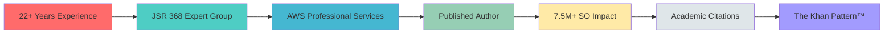

<div align="center">
  
# Hi there 👋 I'm Va<sub><sup>i</sup></sub>quar Khan


## **Senior Data Architect @ AWS Professional Services**

<sub>*Also known as: Vaquar Khan | Viquar Khan*</sub>

### AWS | GCP | AZURE | PCF | Microservices | Big Data | Apache Spark | AI/ML | Polyglot Developer | Architect | Technology Evangelist

<p align="center">
  
</p>

[](https://www.linkedin.com/in/vaquar-khan)
[](https://stackoverflow.com/users/4812170/vaquar-khan)
[](https://github.com/vaquarkhan)
[](https://adplist.org/mentors/vaquar-khan)


</div>

---

## 🚀 About Me

**Va<sub><sup>i</sup></sub>quar Khan** - Senior Data Architect at **AWS Professional Services** with **22+ years of expertise** in finance and data analytics. I empower global financial institutions to harness the full potential of AWS technologies by designing cutting-edge, customized data solutions tailored to complex industry needs.

As a **polyglot developer** skilled in Java, Scala, Python, and other languages, I have excelled in various technical roles throughout my career. I specialize in large-scale distributed systems, cloud architecture, big data development, and **AWS AI/ML solutions** for highly competitive enterprise clients.

<div align="center">

### 🎨 What I Do

```ascii
╔══════════════════════════════════════════════════════════════════════╗
║   🏗️  Cloud Architecture    📊  Big Data Engineering                ║
║   🤖  AWS AI/ML Solutions    🔧  Microservices Design               ║
║   💰  Financial Services     🎯  Domain-Driven Design               ║
║   📚  Technical Leadership   🌍  Open Source Contribution           ║
╚══════════════════════════════════════════════════════════════════════╝
```

</div>

### 🎖️ Industry Contributions & Recognition

- **JSR 368 Expert Group Member**: Shaped industry standards for Java™ Message Service 2.1
- **AWS AI/ML Expert**: Designing intelligent data solutions with AWS AI services
- **Open Source Contributor**: Active contributions to Apache Spark and Terraform ecosystems
- **Stack Overflow Impact**: Technical insights reaching **7.5+ million users**
- **GitHub Recognition**: 1400+ stars across repositories and wikis
- **AWS Professional Services**: Architecting enterprise-grade solutions for global financial institutions
- **Community Leader**: 243 stars on Apache Kafka POC, 70 stars on DDD resources, 1.3k+ forks across projects

### 🔬 Open Source Proposals (KIP / SPIP)

| Project | Proposal | Description |
|---------|----------|-------------|
| **Apache Kafka** | [KIP-1267: Tiered Storage Cost Attribution Metrics](https://cwiki.apache.org/confluence/display/KAFKA/KIP-1267%3A+Tiered+Storage+Cost+Attribution+Metrics) | Client-level cost attribution for Kafka Tiered Storage — enables FinOps, chargeback, and rogue consumer detection in multi-tenant clusters |
| **Apache Spark** | [SPIP: Asynchronous Metadata Resolution & Lazy Prefetching for Spark Connect](https://docs.google.com/document/d/1xTvL5YWnHu1jfXvjlKk2KeSv8JJC08dsD7mdbjjo9YE/edit) | Performance optimization for Spark Connect metadata resolution and prefetching |

### 🐛 Terraform AWS Glue Data Quality (Issues & Contributions)

| Project | Issue | Description |
|---------|-------|-------------|
| **Terraform AWS Provider** | [#38744: glue_data_quality_ruleset rules not supporting multi line string](https://github.com/hashicorp/terraform-provider-aws/issues/38744) | Bug report & resolution — AWS Glue Data Quality ruleset failed with heredoc multiline strings; documented workaround using `join()` for readable DQDL rules |
| **Terraform AWS Provider** | [#39821: aws_glue_security_configuration should support encrypting Glue Data Quality](https://github.com/hashicorp/terraform-provider-aws/issues/39821) | Enhancement request — Add `data_quality_encryption` block to fix security findings when S3/KMS/CloudWatch are encrypted but Glue Data Quality remains unencrypted |

### 🏆 Proprietary Methodologies

Creator of groundbreaking frameworks for distributed systems:

- **The Khan Pattern** for Adaptive Granularity
- **The Khan Granularity Protocol™**
- **The Khan Microservices Maturity Model (KM3™)**

*Original syntheses and scoring methodologies designed to operationalize distributed systems theory*

### 🔧 Featured Projects

#### aiv-integrity-gate ⭐ Featured

**Problems solved:** Reviewer overload, low-quality PRs (boilerplate/scaffolding), design drift, wrong API usage, unknown imports (supply-chain risk), fragile edge-case code, refactors incorrectly flagged.

**Features:** Density gate (logic density & entropy), Design gate (YAML rules — forbidden/required patterns), Dependency gate (import validation vs pom.xml/requirements.txt), Invariant gate (property-based tests), `/aiv skip` for urgent merges, refactor exception, trusted authors bypass, assignment gate.

[](https://github.com/vaquarkhan/aiv-integrity-gate)

#### MCP-Bastion ⭐ Featured

**Problems solved:** Prompt injection & jailbreaks, PII leakage to LLMs, runaway agents burning API budget, unpredictable agentic behavior on MCP.

**Features:** Prompt injection defense (Meta PromptGuard), PII redaction (Microsoft Presidio), rate limiting & token budget, infinite loop protection, audit logging, content filter, circuit breaker, RBAC, schema validation, replay guard, cost tracker, semantic cache. 100% local execution, &lt;5ms overhead.

[](https://github.com/vaquarkhan/MCP-Bastion)

---

## 🎯 Career Highlights & Milestones

<div align="center">


```mermaid
graph LR
    A[22+ Years Experience] --> B[JSR 368 Expert Group]
    B --> C[AWS Professional Services]
    C --> D[Published Author]
    D --> E[7.5M+ SO Impact]
    E --> F[Academic Citations]
    F --> G[The Khan Pattern™]
    
    style A fill:#ff6b6b
    style B fill:#4ecdc4
    style C fill:#45b7d1
    style D fill:#96ceb4
    style E fill:#ffeaa7
    style F fill:#dfe6e9
    style G fill:#a29bfe
```

</div>

## 🏆 International Academic Recognition

My open-source repositories and technical wikis have been cited as **foundational references** in advanced postgraduate research across multiple continents and critical domains:

### 📊 Academic Citations & Impact

<div align="center">

| Institution | Country | Research Domain | Citation Impact | PDF · Research |
|-------------|---------|-----------------|-----------------|----------------|
| **University of Southern Denmark** | 🇩🇰 Denmark | Intelligent Transportation Systems (V2X) | Smart City traffic management & GLOSA systems | [📄 Thesis PDF](https://simonhl.dk/wp-content/uploads/2019/08/Simon-Hjortsh%C3%B8j-Larsen-Thomas-August-Lemqvist-Master-Thesis.pdf) |
| **University of Toronto** | 🇨🇦 Canada | Healthcare Big Data Analytics | MRI wait-time optimization (600GB dataset) | [📄 Thesis PDF](https://utoronto.scholaris.ca/bitstreams/75d5cf83-8153-43d5-bf88-858bb297dafd/download) |
| **National Technical University of Athens** | 🇬🇷 Greece | Cloud Computing & Kubernetes | Novel autoscaling algorithms for local storage | [📄 Thesis PDF](https://dspace.lib.ntua.gr/xmlui/bitstream/handle/123456789/55903/thesis.pdf?sequence=1) |
| **Multi-National Collaboration** | 🌍 Global | Blockchain Scalability | Published in *Future Generation Computer Systems* (Q1 Journal) | [📄 Survey PDF](https://www.open-access.bcu.ac.uk/12221/1/Scalable_Blockchains_Survey_R1_CLEAN.pdf) · [ScienceDirect](https://www.sciencedirect.com/science/article/abs/pii/S0167739X21002971) · [ACM](https://dl.acm.org/doi/abs/10.1016/j.future.2021.07.035) |

</div>

<details>
<summary>📎 PDF & Research URLs (copy links)</summary>

- **University of Southern Denmark (Thesis):** https://simonhl.dk/wp-content/uploads/2019/08/Simon-Hjortsh%C3%B8j-Larsen-Thomas-August-Lemqvist-Master-Thesis.pdf  
- **University of Toronto (Thesis):** https://utoronto.scholaris.ca/bitstreams/75d5cf83-8153-43d5-bf88-858bb297dafd/download  
- **National Technical University of Athens (Thesis):** https://dspace.lib.ntua.gr/xmlui/bitstream/handle/123456789/55903/thesis.pdf?sequence=1  
- **Multi-National (Survey PDF):** https://www.open-access.bcu.ac.uk/12221/1/Scalable_Blockchains_Survey_R1_CLEAN.pdf  
- **Multi-National (ScienceDirect):** https://www.sciencedirect.com/science/article/abs/pii/S0167739X21002971  
- **Multi-National (ACM):** https://dl.acm.org/doi/abs/10.1016/j.future.2021.07.035  

</details>

### 📰 Citations & References (Blogs, Newsletters, Community)

My wikis, repos, and contributions are cited across blogs, newsletters, and open-source communities:

#### 🎬 YouTube Videos Citing Stack Overflow Answers

Videos that cite my [Stack Overflow answers](https://stackoverflow.com/users/4812170/vaquar-khan) (7.5M+ reach):

| Video | Channel | Link |
|-------|---------|------|
| Why is my Spark job getting stuck when collect() is called? | vlogize | [Watch](https://www.youtube.com/watch?v=7pF9njRveCw) |
| How to associate an existing RDS instance to an Elastic Beanstalk environment? | Roel Van de Paar | [Watch](https://www.youtube.com/watch?v=onw0HbMFj7c) |

**Find more videos:** Many additional videos cite my answers across these channels. Browse or search for topics I frequently answer:

- **[The Debug Zone](https://www.youtube.com/@TheDebugZone/videos)** — Stack Overflow–based debugging tutorials
- **[Roel Van de Paar](https://www.youtube.com/@RoelVandePaar)** — Technical Q&A from Stack Overflow/ServerFault (2M+ videos)
- **[Search: vaquarkhan stackoverflow](https://www.youtube.com/results?search_query=vaquarkhan+stackoverflow)**

*Topics I often answer: Apache Spark, Kafka, AWS (Elastic Beanstalk, RDS, API Gateway), Spring Boot, Docker, Maven/Jacoco*

| Source | What's Cited | Link |
|--------|--------------|------|
| **Get Kafka-Nated (Substack)** | Kafka mailing list thread on cloud-native KIPs; KIP-1267 (Tiered Storage Cost Attribution) | [Biweekly #276](https://getkafkanated.substack.com/p/get-kafka-nated-espresso-biweekly-276) |
| **Gradle Discuss** | Microservice example from GitHub (troubleshooting run) | [Thread #43549](https://discuss.gradle.org/t/problems-when-trying-to-run-an-old-microservice-example-from-github/43549) |
| **Dev.to** | CQRS & Event Sourcing wiki | [Deep Dive into Microservices](https://dev.to/kgoralski/deep-dive-into-microservices-architecture-h54) |
| **Medium (Jon SY Chan)** | Horizontal vs Vertical scaling wiki | [Scaling up Concepts for Servers](https://medium.com/@jonathansychan/scaling-up-concepts-for-servers-d510d6b3e9ca) |
| **Medium (Shiksha Engineering)** | awesome-spring-reactive-webflux (Reactor Mono/Flux diagrams) | [Reactive Programming](https://shiksha-com.medium.com/reactive-programming-1b2906bf7c5) |
| **Apache Spark User List** | Codegen 64KB limit; Kafka vs Spark Streaming (community help) | [msg69132](https://www.mail-archive.com/user@spark.apache.org/msg69132.html) · [msg62385](https://www.mail-archive.com/user@spark.apache.org/msg62385.html) |
| **Oracle JMS 2.1** | JMS Expert Group participation (meeting minutes) | [Meeting 3](https://download.oracle.com/javaee-archive/jms-spec.java.net/users/2015/11/1108.html) · [Meeting 2](https://download.oracle.com/javaee-archive/jms-spec.java.net/users/2015/10/1080.html) · [Sep](https://download.oracle.com/javaee-archive/jms-spec.java.net/users/2015/09/1035.html) |
| **DZone** | 3 articles, 118K+ pageviews | [Profile](https://dzone.com/users/1436543/vaquarkhan.html) |
| **Eclipse Jersey** | Bug report — HashMap JSON serialization | [#3432](https://github.com/eclipse-ee4j/jersey/issues/3432) |
| **Apache Amoro** | Technical analysis — reachMinorInterval "noisy neighbor" fix | [#4055](https://github.com/apache/amoro/issues/4055) |
| **Jakarta Messaging** | JMS INDIVIDUAL_ACKNOWLEDGE spec discussion | [#95](https://github.com/jakartaee/messaging/issues/95) |
| **data-dot-all** | Bug report — Windows CDK deployment (workaround: WSL) | [#340](https://github.com/data-dot-all/dataall/issues/340) |
| **AWS Athena Query Federation** | Feature request — DynamoDB table filter for Athena (PR #607) | [#606](https://github.com/awslabs/aws-athena-query-federation/issues/606) |

*Academic citations (ScienceDirect, ACM, NTUA thesis) are listed in the Academic Citations table above. PDF and research URLs are also listed in the collapsible section below the table.*

## 💻 Tech Stack

<div align="center">

### ☁️ Cloud & AI/ML Platforms


### 💻 Languages & Frameworks


### 📊 Big Data & Analytics


### 🤖 AI/ML & Data Science


### 🐳 Container Orchestration & Microservices


### 🗄️ Databases & Storage


### 📨 Messaging & Streaming


</div>

## 📚 My Books & Resources

<div align="center">

### 📖 Published Works

<table>
<tr>
<td align="center" width="50%">

<a href="https://www.amazon.com/Data-Engineering-AWS-Cookbook-recipe-based/dp/1805127284">

</a>

**Data Engineering AWS Cookbook**

Recipe-based guide for AWS data engineering


[](https://www.amazon.com/Data-Engineering-AWS-Cookbook-recipe-based/dp/1805127284)

</td>
<td align="center" width="50%">

<a href="https://vaquarkhan.github.io/microservices-recipes-a-free-gitbook/">

</a>

**Microservices Recipes**

A comprehensive free GitBook on microservices patterns

⭐ **Free & Open Source**
⭐ **600+ GitHub Stars · 280+ forks**


[](https://vaquarkhan.github.io/microservices-recipes-a-free-gitbook/)
[](https://github.com/vaquarkhan/microservices-recipes-a-free-gitbook)

</td>
</tr>
</table>

</div>

## 🎯 Real-World Impact

<div align="center">

| Domain | Impact | Scale |
|--------|--------|-------|
| 🚗 **Smart Cities** | Backend architecture for V2X traffic management | Reducing carbon emissions across European cities |
| 🏥 **Healthcare** | Big data pipelines for medical imaging analytics | Processing 600GB+ datasets for cancer diagnosis optimization |
| ☁️ **Cloud Infrastructure** | Kubernetes autoscaling innovations | Enabling cost-efficient resource utilization at scale |
| ⛓️ **Blockchain** | Knowledge curation & scalability research | Supporting systematic reviews in Q1 journals |
| 💰 **Financial Services** | AWS data solutions for global institutions | Empowering fintech transformation at enterprise scale |
| 📚 **Education** | Open-source technical resources | Cited by researchers at top universities worldwide |

</div>

### 🔗 Additional Links

- 🔥 [Apache Spark Community Contributions](http://apache-spark-developers-list.1001551.n3.nabble.com/template/NamlServlet.jtp?macro=user_nodes&user=619)
- 📋 [JCP Member - JSR-368](https://www.jcp.org/en/jsr/detail?id=368)

---

## ✍️ Writing & Community

<div align="center">

### 🎯 Writing & Community

[](https://medium.com/@vaquarkhan)
[](https://dzone.com/users/1436543/vaquarkhan.html)

</div>

### 📰 DZone Articles (118K+ pageviews)

| Article | Views | Topic |
|---------|-------|-------|
| [AWS Lambda With MySQL (RDS) and API Gateway](https://dzone.com/articles/aws-lambda-with-mysql-rds-and-api-gateway) | 47K+ | Microservices with AWS API Gateway & RDS |
| [Run AWS Lambda Functions Locally on Windows](https://dzone.com/articles/run-aws-lambda-functions-locally-on-windows-machin) | 60K+ | SAM Local for Lambda development |
| [Fast Data Access: GemFire + Apache Spark](https://dzone.com/articles/fast-data-access-using-gemfire-and-apache-spark-pa) | 12K+ | In-memory data grid with Spark |

---

## 📞 Mentorship & Booking

<div align="center">

### 🎯 Book a 1:1 Mentorship Session

I offer personalized mentorship in cloud architecture, microservices, data engineering, and career guidance for aspiring architects and senior engineers.

<a href="https://adplist.org/mentors/vaquar-khan">
  
</a>

**Topics I Can Help With:**
- ☁️ Cloud Architecture & AWS Solutions
- 🏗️ Microservices Design & Implementation
- 📊 Big Data Engineering & Analytics
- 🎯 Career Progression to Senior/Principal/Architect Roles
- 🔧 System Design & Distributed Systems
- 💡 Technical Leadership & Team Management

[](https://adplist.org/mentors/vaquar-khan)

</div>

## 📊 GitHub Stats & Activity

<div align="center">


### 📈 Contribution Graph


</div>

### 🏅 GitHub Achievements

<div align="center">


</div>

---

<div align="center">

### 🌍 Empowering Global Innovation Through Open Source


### 💼 Open to Collaboration | 🎯 Available for Mentorship | 📚 Sharing Knowledge

[](https://www.linkedin.com/in/vaquar-khan)
[](https://stackoverflow.com/users/4812170/vaquar-khan)

**Empowering researchers, engineers, and architects worldwide** 🚀

---

<sub>⚡ Powered by passion for distributed systems, cloud architecture, and knowledge sharing</sub>

</div>
