<div align="center">
  
# Hi there 👋 I'm Va<sub><sup>i</sup></sub>quar Khan


## **Senior Data Architect @ AWS Professional Services**

<sub>*Also known as: Vaquar Khan | Viquar Khan*</sub>

### AWS | GCP | AZURE | PCF | Microservices | Big Data | Apache Spark | AI/ML | Polyglot Developer | Architect | Technology Evangelist

<p align="center">
  
</p>

[](https://linkedin.com)
[](http://stackoverflow.com/users/4812170/vaquar-khan)
[](https://github.com/vaquarkhan)
[](https://adplist.org/mentors/vaquar-khan)


</div>

---

## 🚀 About Me

**Va<sub><sup>i</sup></sub>quar Khan** - Senior Data Architect at **AWS Professional Services** with **22+ years of expertise** in finance and data analytics. I empower global financial institutions to harness the full potential of AWS technologies by designing cutting-edge, customized data solutions tailored to complex industry needs.

As a **polyglot developer** skilled in Java, Scala, Python, and other languages, I have excelled in various technical roles throughout my career. I specialize in large-scale distributed systems, cloud architecture, big data development, and **AWS AI/ML solutions** for highly competitive enterprise clients.

<div align="center">

### 🎨 What I Do

```ascii
╔══════════════════════════════════════════════════════════════════════╗
║                                                                      ║
║   🏗️  Cloud Architecture    📊  Big Data Engineering                ║
║   🤖  AWS AI/ML Solutions    🔧  Microservices Design               ║
║   💰  Financial Services     🎯  Domain-Driven Design               ║
║   📚  Technical Leadership   🌍  Open Source Contribution           ║
║                                                                      ║
╚══════════════════════════════════════════════════════════════════════╝
```

</div>

### 🎖️ Industry Contributions & Recognition

- **JSR 368 Expert Group Member**: Shaped industry standards for Java™ Message Service 2.1
- **AWS AI/ML Expert**: Designing intelligent data solutions with AWS AI services
- **Open Source Contributor**: Active contributions to Apache Spark and Terraform ecosystems
- **Stack Overflow Impact**: Technical insights reaching **7.5+ million users**
- **GitHub Recognition**: 1400+ stars across repositories and wikis
- **AWS Professional Services**: Architecting enterprise-grade solutions for global financial institutions
- **Community Leader**: 243 stars on Apache Kafka POC, 70 stars on DDD resources, 1.3k+ forks across projects

### 🌐 Community Impact & Reach

<div align="center">

| Platform | Metric | Impact Area |
|----------|--------|-------------|
| 📊 **Stack Overflow** | 7.5M+ Reach | Helping developers solve complex problems |
| ⭐ **GitHub Stars** | 1400+ Total | Open-source knowledge sharing |
| 🎓 **Academic Citations** | 4+ Universities | Foundational research references |
| 💬 **Apache Spark Community** | Active Contributor | Distributed computing expertise |

</div>

### 🏆 Proprietary Methodologies

Creator of groundbreaking frameworks for distributed systems:

- **The Khan Pattern™** for Adaptive Granularity
- **The Khan Granularity Protocol™**
- **The Khan Microservices Maturity Model (KM3™)**

*Original syntheses and scoring methodologies designed to operationalize distributed systems theory*

---

<div align="center">

### ⚡ Quick Facts

| 💼 Experience | 📊 Impact | 🎯 Specialization |
|---------------|-----------|-------------------|
| 22+ Years | 7.5M+ SO Reach | Cloud Architecture |
| AWS Professional Services | 1400+ GitHub Stars | Data Engineering |
| Global Financial Institutions | 600+ Book Stars | Microservices Design |

</div>

---

## 🎯 Career Highlights & Milestones

```mermaid
graph LR
    A[22+ Years Experience] --> B[JSR 368 Expert Group]
    B --> C[AWS Professional Services]
    C --> D[Published Author]
    D --> E[7.5M+ SO Impact]
    E --> F[Academic Citations]
    F --> G[The Khan Pattern™]
    
    style A fill:#ff6b6b
    style B fill:#4ecdc4
    style C fill:#45b7d1
    style D fill:#96ceb4
    style E fill:#ffeaa7
    style F fill:#dfe6e9
    style G fill:#a29bfe
```

<div align="center">



## 🏆 International Academic Recognition

My open-source repositories and technical wikis have been cited as **foundational references** in advanced postgraduate research across multiple continents and critical domains:

### 📊 Academic Citations & Impact

<div align="center">

| Institution | Country | Research Domain | Citation Impact |
|-------------|---------|-----------------|-----------------|
| **University of Southern Denmark** | 🇩🇰 Denmark | Intelligent Transportation Systems (V2X) | Smart City traffic management & GLOSA systems |
| **University of Toronto** | 🇨🇦 Canada | Healthcare Big Data Analytics | MRI wait-time optimization (600GB dataset) |
| **National Technical University of Athens** | 🇬🇷 Greece | Cloud Computing & Kubernetes | Novel autoscaling algorithms for local storage |
| **Multi-National Collaboration** | 🌍 Global | Blockchain Scalability | Published in *Future Generation Computer Systems* (Q1 Journal) |

</div>

### 🎓 Research Areas Where My Work Has Been Cited

- **Smart City Infrastructure**: V2X communication protocols, traffic optimization, and carbon emission reduction
- **Healthcare Operations Research**: Big data processing for cancer diagnosis optimization
- **Cloud Architecture**: Kubernetes internals, distributed systems scaling strategies
- **Blockchain Technology**: Scalability solutions and systematic reviews in top-tier journals

### 📚 Key Technical Contributions Referenced

- **Scaling Architectures**: Horizontal vs Vertical scaling strategies for distributed systems
- **Kubernetes Architecture**: Comprehensive overview of control plane and main concepts
- **Blockchain Guide**: Curated resources serving as meta-index for systematic reviews

## 💻 Tech Stack

<div align="center">

### ☁️ Cloud & AI/ML Platforms


### 💻 Languages & Frameworks


### 📊 Big Data & Analytics


### 🤖 AI/ML & Data Science


### 🐳 Container Orchestration & Microservices


### 🗄️ Databases & Storage


### 📨 Messaging & Streaming


</div>

## 🌟 Featured Open Source Projects

<div align="center">


## 📚 My Books & Resources

<div align="center">

### 📖 Published Works

<table>
<tr>
<td align="center" width="50%">

<a href="https://www.amazon.com/Data-Engineering-AWS-Cookbook-recipe-based/dp/1805127284">

</a>

**Data Engineering AWS Cookbook**

Recipe-based guide for AWS data engineering


[](https://www.amazon.com/Data-Engineering-AWS-Cookbook-recipe-based/dp/1805127284)

</td>
<td align="center" width="50%">

<a href="https://vaquarkhan.github.io/microservices-recipes-a-free-gitbook/">

</a>

**Microservices Recipes**

A comprehensive free GitBook on microservices patterns

⭐ **Free & Open Source**
⭐ **600+ GitHub Stars ,280+ fork**


[](https://vaquarkhan.github.io/microservices-recipes-a-free-gitbook/)
[](https://github.com/vaquarkhan/microservices-recipes-a-free-gitbook)

</td>
</tr>
</table>

</div>

## 🌟 Expertise Areas

<div align="center">

### 🎯 Core Competencies

</div>

- ☁️ **Cloud Architecture**: AWS, GCP, Azure, PCF - Multi-cloud solutions for enterprise clients
- 🤖 **AWS AI/ML Expert**: SageMaker, Bedrock, and intelligent data solutions
- 🏗️ **System Design**: Large-scale distributed systems architecture
- 📊 **Big Data Engineering**: Apache Spark, Hadoop, Kafka, Airflow - data pipeline optimization
- 🔧 **Microservices Architecture**: Designing and implementing scalable, resilient distributed systems
- 🎯 **Cloud-Native Development**: Building applications for modern cloud platforms
- 🧩 **Domain-Driven Design**: Applying DDD principles to create well-bounded microservices
- 💡 **Polyglot Development**: Java, Scala, Python, Go - choosing the right tool for the job
- 👥 **Team Leadership**: Guiding development teams through architectural transformations
- 🚗 **Intelligent Transportation**: V2X communication systems and smart city infrastructure
- 🏥 **Healthcare Analytics**: Big data processing for medical research and optimization
- ⛓️ **Blockchain**: Scalability solutions and distributed ledger technologies
- 💰 **Financial Services**: Advanced data solutions for global financial institutions

<div align="center">

### 📊 Technology Proficiency


</div>

## 🎯 Real-World Impact

<div align="center">

| Domain | Impact | Scale |
|--------|--------|-------|
| 🚗 **Smart Cities** | Backend architecture for V2X traffic management | Reducing carbon emissions across European cities |
| 🏥 **Healthcare** | Big data pipelines for medical imaging analytics | Processing 600GB+ datasets for cancer diagnosis optimization |
| ☁️ **Cloud Infrastructure** | Kubernetes autoscaling innovations | Enabling cost-efficient resource utilization at scale |
| ⛓️ **Blockchain** | Knowledge curation & scalability research | Supporting systematic reviews in Q1 journals |
| 💰 **Financial Services** | AWS data solutions for global institutions | Empowering fintech transformation at enterprise scale |
| 📚 **Education** | Open-source technical resources | Cited by researchers at top universities worldwide |

</div>

### 🌍 Global Reach

<div align="center">

```text
📊 Stack Overflow Impact:     7.5M+ developers reached
⭐ GitHub Recognition:         1400+ stars across repositories  
🎓 Academic Citations:         4+ universities across 3 continents
📖 Published Books:            600+ stars on AWS Cookbook
🌐 Open Source Contributions:  Apache Spark, Terraform, and more
```

</div>

## 🤝 Connect With Me

<div align="center">

[](https://linkedin.com)
[](https://github.com/vaquarkhan)
[](http://stackoverflow.com/users/4812170/vaquar-khan)

</div>

### 🔗 Additional Links

- 🔥 [Apache Spark Community Contributions](http://apache-spark-developers-list.1001551.n3.nabble.com/template/NamlServlet.jtp?macro=user_nodes&user=619)
- 📋 [JCP Member - JSR-368](https://www.jcp.org/en/jsr/detail?id=368)

## 📞 Mentorship & Booking

<div align="center">

### 🎯 Book a 1:1 Mentorship Session

I offer personalized mentorship in cloud architecture, microservices, data engineering, and career guidance for aspiring architects and senior engineers.

<a href="https://adplist.org/mentors/vaquar-khan">
  
</a>

**Topics I Can Help With:**
- ☁️ Cloud Architecture & AWS Solutions
- 🏗️ Microservices Design & Implementation
- 📊 Big Data Engineering & Analytics
- 🎯 Career Progression to Senior/Principal/Architect Roles
- 🔧 System Design & Distributed Systems
- 💡 Technical Leadership & Team Management

[](https://adplist.org/mentors/vaquar-khan)

</div>

## 📊 GitHub Stats & Activity

<div align="center">


### 📈 Contribution Graph


</div>

### 🏅 GitHub Achievements

<div align="center">


</div>

## 💡 What I'm Working On

- 🔭 Architecting scalable cloud-native applications for global financial institutions
- 🌱 Advancing data engineering patterns and big data architectures on AWS
- 👯 Contributing to open-source projects (Apache Spark, Terraform) and technical knowledge bases
- 💬 Sharing expertise through books, wikis, and community engagement
- ⚡ Solving complex distributed systems challenges across multiple domains
- 📖 Maintaining technical resources cited by researchers at top global universities
- 🎯 Mentoring the next generation of architects and senior engineers

## 🎓 Featured Contributions & Recognition

<div align="center">

### 🏆 Highlights

| Achievement | Details |
|-------------|---------|
| 📚 **JSR 368 Expert Group** | Shaped Java™ Message Service 2.1 industry standards |
| 🌟 **Stack Overflow Top Contributor** | 7.5M+ developers reached with technical insights |
| 📖 **Published Author** | AWS Cookbook & Microservices Recipes: The Architect's Field Guide  with 600+ GitHub stars |
| 🎯 **Academic Impact** | Cited by University of Toronto, University of Southern Denmark, NTUA |
| 💡 **Innovation** | Creator of The Khan Pattern™ and KM3™ frameworks |
| 🌍 **Open Source** | Active contributor to Apache Spark and Terraform ecosystems |

</div>

---

<div align="center">

### 🌍 Empowering Global Innovation Through Open Source


### 💼 Open to Collaboration | 🎯 Available for Mentorship | 📚 Sharing Knowledge

[](https://adplist.org/mentors/vaquar-khan)
[](https://linkedin.com)
[](http://stackoverflow.com/users/4812170/vaquar-khan)

**Empowering researchers, engineers, and architects worldwide** 🚀

---

<sub>⚡ Powered by passion for distributed systems, cloud architecture, and knowledge sharing</sub>

</div>
