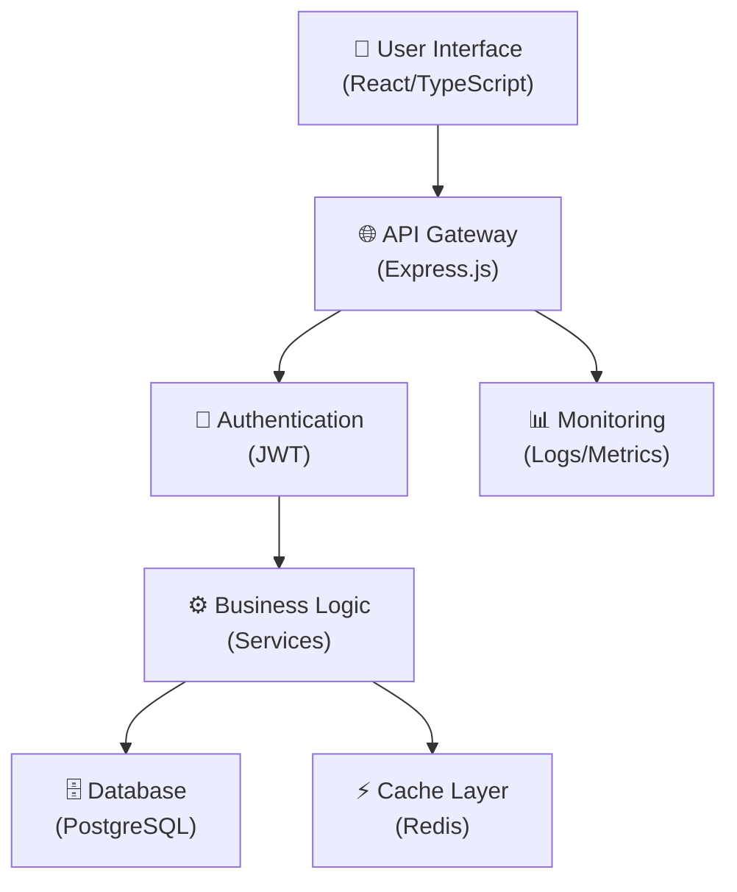
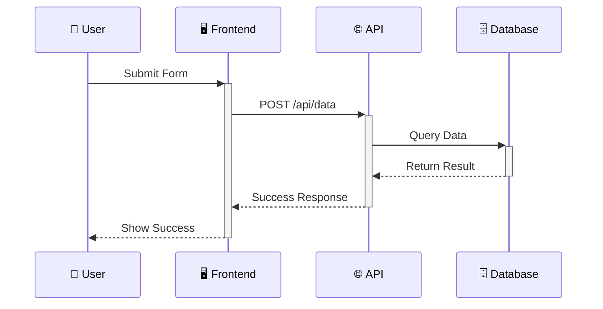
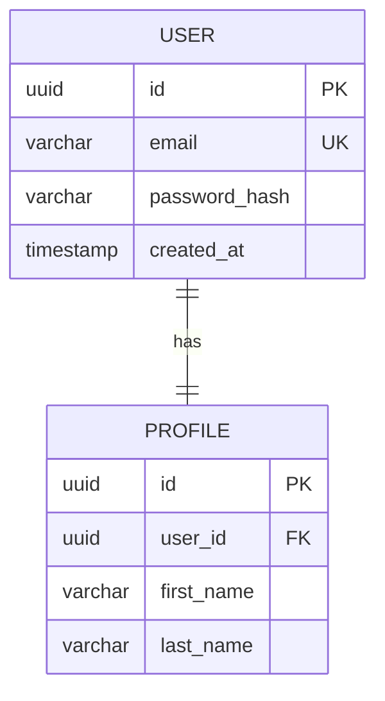

# 🎨 TurboAgile Diagram Generator

## Overview

The TurboAgile Diagram Generator is an integrated visual documentation system that automatically creates interactive diagrams for your user stories and project architecture. Based on the structure from [oscarismael47/diagram_generator](https://github.com/oscarismael47/diagram_generator), it provides comprehensive visual representations of your development workflow.

## 🚀 Features

### 📊 Supported Diagram Types

1. **Architecture Diagrams** - System component relationships
2. **Sequence Diagrams** - User interaction flows  
3. **ER Diagrams** - Database entity relationships
4. **Class Diagrams** - Code structure and relationships
5. **Deployment Diagrams** - Infrastructure and deployment topology
6. **Flow Diagrams** - Business process flows
7. **Timeline/Gantt Charts** - Project scheduling and dependencies

### 🎯 Key Capabilities

- **Auto-Generation**: Diagrams are automatically generated from story content
- **Interactive**: Click-to-generate from story modals
- **Export Ready**: Export diagrams as Mermaid code or SVG
- **Theme Aware**: Automatically adapts to dark/light themes
- **Responsive**: Mobile-friendly diagram viewing
- **Real-time**: Instant diagram generation and updates

## 🛠️ Integration

### Story Modal Integration

Each story modal now includes diagram generation buttons:

```typescript
// Architecture Section
🏗️ AI Architect
├── Generate Architecture
├── 📊 Architecture Diagram
├── 🔄 Sequence Diagram  
└── 🗄️ Database ER

// Developer Section  
💻 AI Developer
├── Generate Code
├── 📋 Class Diagram
└── 🚀 Deployment Diagram

// DevOps Section
🚀 AI DevOps  
├── Deploy to Production
└── 🔄 System Flow
```

### Project Timeline

Access project-wide timeline visualization:

- **Project Board** → **📅 Project Timeline** button
- Gantt chart showing story dependencies
- Visual project progress tracking
- Export capabilities for project planning

## 📋 Usage Examples

### 1. Architecture Diagram



### 2. Sequence Diagram



### 3. Database ER Diagram



## 🎨 Customization

### Theme Configuration

The diagram generator automatically adapts to your theme:

```javascript
// Dark Theme
mermaid.initialize({
    theme: 'dark',
    themeVariables: {
        primaryColor: '#6366f1',
        primaryTextColor: '#f9fafb',
        background: '#111827'
    }
});
```

### Custom Diagram Types

Extend the generator with custom diagram types:

```typescript
// Add custom diagram type
function generateCustomDiagram(story: any): string {
    return `graph TD
        A[Custom Node] --> B[Another Node]
        B --> C[End Node]`;
}

// Register in generateDiagram function
case 'custom':
    mermaidCode = generateCustomDiagram(story);
    break;
```

## 📁 File Structure

```
src/
├── utils/
│   └── diagramGenerator.ts     # Main diagram generator class
├── components/
│   ├── StoryManager.js         # Story management integration
│   └── ArchitectureModal.js    # Architecture modal integration
└── styles/
    └── main-fixes.css          # Diagram-specific styling
```

## 🔧 API Reference

### DiagramGenerator Class

```typescript
class DiagramGenerator {
    // Generate architecture diagram
    generateArchitectureDiagram(story: any): string
    
    // Generate sequence diagram  
    generateSequenceDiagram(story: any): string
    
    // Generate ER diagram
    generateERDiagram(story: any): string
    
    // Generate class diagram
    generateClassDiagram(story: any): string
    
    // Generate deployment diagram
    generateDeploymentDiagram(story: any): string
    
    // Generate project timeline
    generateTimelineDiagram(stories: any[]): string
    
    // Render diagram to DOM
    renderDiagram(mermaidCode: string, containerId: string): void
    
    // Export diagram
    exportDiagram(mermaidCode: string, format: 'svg' | 'png'): Promise<string>
}
```

### Global Functions

```typescript
// Generate diagram for story
generateDiagram(storyId: string, diagramType: string): Promise<void>

// Export diagram as file
exportDiagram(storyId: string, diagramType: string): void

// Regenerate diagram
regenerateDiagram(storyId: string, diagramType: string): void

// Show project timeline
showProjectTimeline(): void
```

## 🎯 Best Practices

### 1. Story Content Optimization

For better diagram generation, ensure stories include:

- Clear acceptance criteria
- Technical requirements
- Component relationships
- Data flow descriptions

### 2. Diagram Maintenance

- Regenerate diagrams when stories change
- Export important diagrams for documentation
- Use consistent naming conventions
- Keep diagrams focused and readable

### 3. Performance Considerations

- Diagrams are generated on-demand
- Large projects may take longer to render
- Consider breaking complex diagrams into smaller parts
- Use caching for frequently accessed diagrams

## 🔍 Testing

Test the diagram generator using the included test page:

```bash
# Open test page in browser
open test-diagrams.html
```

The test page includes:
- All diagram types with sample data
- Export functionality testing
- Theme switching validation
- Responsive design verification

## 🚀 Future Enhancements

### Planned Features

1. **Interactive Diagrams** - Clickable nodes with drill-down capability
2. **Collaborative Editing** - Real-time diagram collaboration
3. **Version Control** - Diagram versioning and history
4. **Custom Templates** - Industry-specific diagram templates
5. **AI Enhancement** - AI-powered diagram optimization
6. **Integration APIs** - Connect with external diagramming tools

### Roadmap

- **Q1 2024**: Interactive diagrams and custom templates
- **Q2 2024**: Collaborative editing and version control
- **Q3 2024**: AI enhancement and optimization
- **Q4 2024**: Advanced integrations and enterprise features

## 📞 Support

For diagram generator support:

- **Documentation**: See inline code comments
- **Examples**: Check `test-diagrams.html`
- **Issues**: Report via GitHub issues
- **Contributions**: Submit PRs for enhancements

## 📄 License

The diagram generator follows the same Apache 2.0 license as the main TurboAgile project.

---

**Ready to visualize your development workflow?** Start generating diagrams from your user stories today! 🎨✨